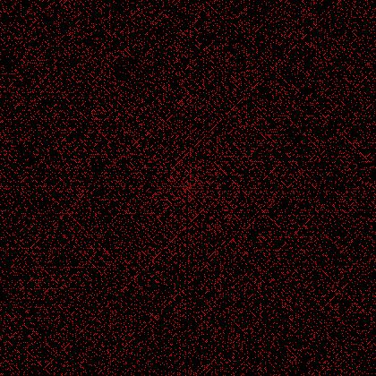
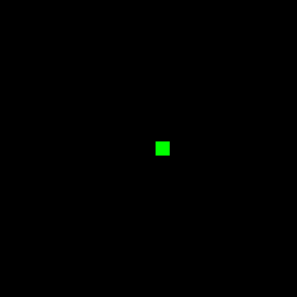

# Ulam spiral

Ulam spiral GIFs with Python.

## About

A Python script to create [Ulam spiral images](https://en.wikipedia.org/wiki/Ulam_spiral) and GIF animations. 

Requirements: **Pillow (PIL)**

### Usage

See ```py spiral.py -h```.
```
  --size SIZE SIZE      Width and height in pixels.
  --fps FPS
  --dimension DIMENSION The grid dimension. Should be an odd number.
  --max_size            Fit as many spirals as possible to the given image
                        size.
  --save_frames         Save every frame that makes up the GIF as a seperate image file.
  --primes_only         Animate only prime numbers in Spiral GIF mode.
  --image               Create a seperate image of the final spiral.
  --spiral              Create a Spiral GIF.
  --expand              Create an Expand GIF.
  --grow                Create a Grow GIF.
```

**Note**: GIF creation can be very RAM usage heavy.

## Demos

``` py spiral.py --image --max_size ```  
  

``` py spiral.py --spiral ```  
  

``` py spiral.py --spiral --primes_only ```  
  

``` py spiral.py --expand --max_size ```  
  

``` py spiral.py --grow --dimension 210 ```  
  
